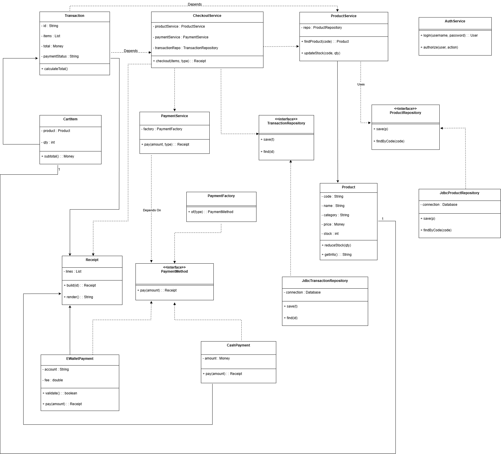
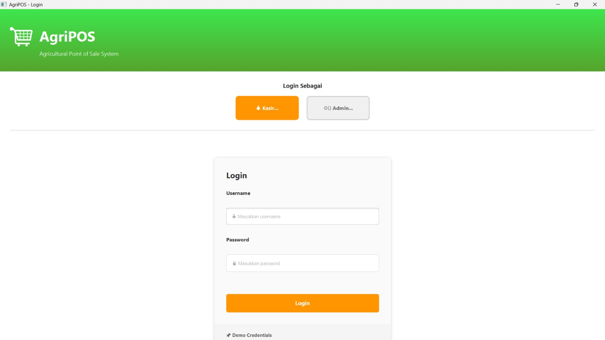
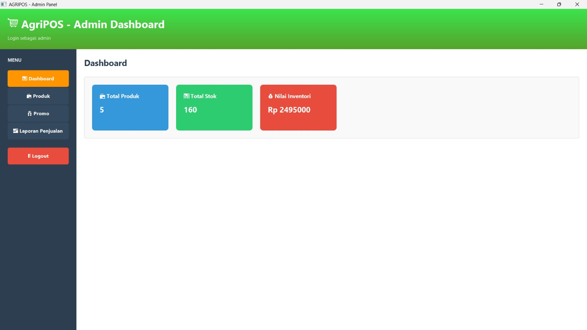
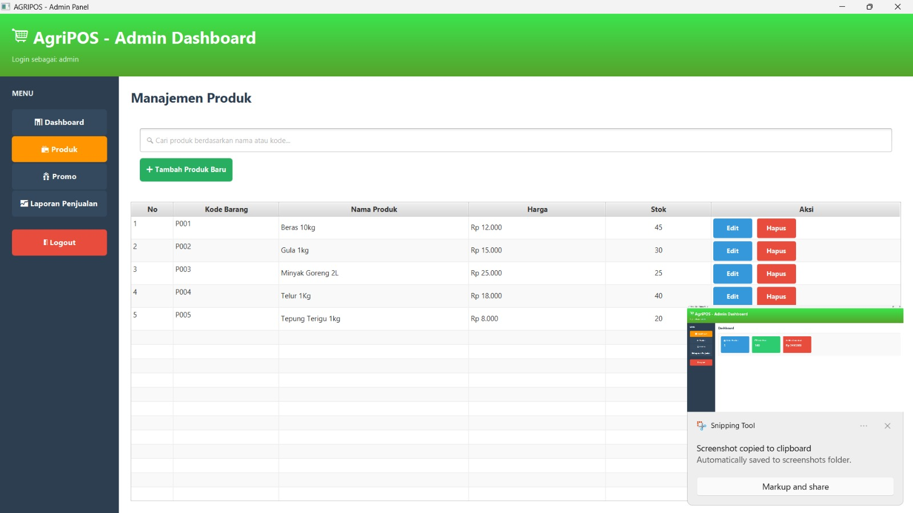
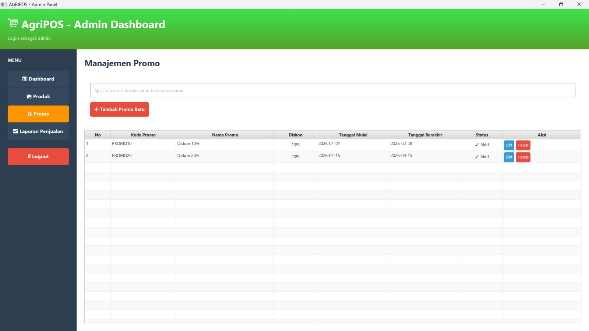
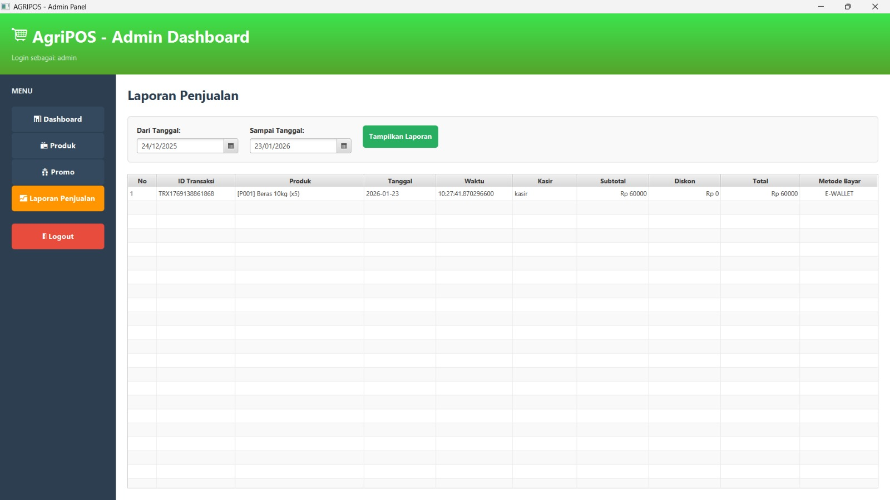
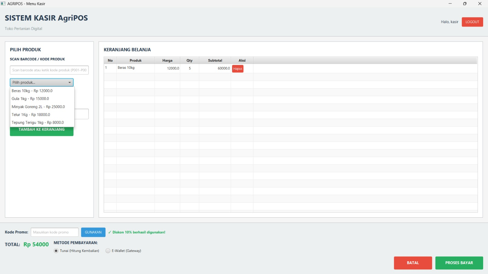
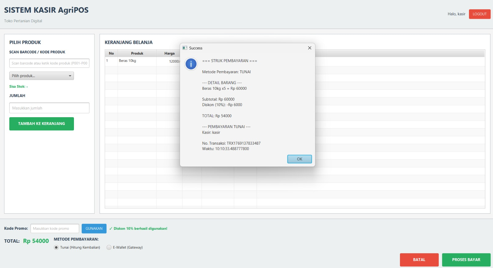

# Laporan Praktikum Minggu 15 : (Proyek kelompok)
Topik: ["Agri-POS - Sistem Point of Sale Pertanian"]

## Identitas
- **Nama + Nim** : 
   Agan Chois (240202893)
   Ridho Kurniawan (240202881)
   Nunik Aulia Primadani (240202875)
   Naufal Zaky (240202874)
- **Kelas** : [3IKRB]

---

## 1. Pendahuluan
### 1.1 Latar Belakang
Perkembangan teknologi informasi mendorong digitalisasi pada berbagai sektor, termasuk sektor agribisnis dan ritel produk pertanian. Proses penjualan manual yang masih banyak digunakan sering menimbulkan permasalahan seperti kesalahan pencatatan transaksi, pengelolaan stok yang tidak akurat, serta keterbatasan dalam pembuatan laporan penjualan. Oleh karena itu, dibutuhkan sebuah sistem terkomputerisasi yang mampu mengelola proses penjualan, pembayaran, dan manajemen produk secara terintegrasi.
Sistem Agripos dirancang sebagai sistem Point of Sale (POS) yang mendukung pengelolaan produk, transaksi penjualan, serta pembayaran baik secara tunai maupun non-tunai (E-Wallet). Sistem ini diharapkan dapat meningkatkan efisiensi, akurasi, dan transparansi dalam proses bisnis.

### 1.2 Tujuan
Tujuan dari perancangan Sistem Agripos adalah: 
1. Merancang sistem penjualan yang terintegrasi antara kasir, admin, dan layanan pembayaran. 
2. Memodelkan kebutuhan sistem menggunakan diagram UML. 
3. Menyediakan gambaran arsitektur sistem yang jelas dan terstruktur.

### 1.3 Ruang Lingkup
Ruang lingkup sistem meliputi: 
- Manajemen produk oleh Admin
- Proses transaksi penjualan oleh Kasir
- Pembayaran tunai dan E-Wallet
- Pengelolaan stok dan pencetakan struk

---

## 2. Gambaran Umum Sistem
Sistem Agripos terdiri dari dua aktor utama, yaitu Admin dan Kasir. Admin bertanggung jawab dalam pengelolaan data produk dan laporan penjualan, sedangkan Kasir bertugas melakukan transaksi penjualan kepada pelanggan. Sistem juga terintegrasi dengan Payment Gateway untuk memproses pembayaran non-tunai.

---

## 3. Use Case Diagram
Use Case Diagram menggambarkan interaksi antara aktor dengan sistem.


### 3.1 Aktor
1.	Admin
   - Login dan Logout
   - Mengelola produk (tambah, update, hapus, dan melihat daftar produk)
   - Validasi data produk
   - Melihat laporan penjualan
2.	Kasir
   - Membuat transaksi
   - Menambahkan produk ke keranjang
   - Memilih metode pembayaran
   - Menghitung total pembayaran
   - Mencetak struk

### 3.2 Deskripsi Use Case
Use case Kelola Produk memiliki relasi <> dengan Tambah Produk, Hapus Produk, dan Daftar Produk. Use case Pembayaran terdiri dari dua metode, yaitu Pembayaran Tunai dan Pembayaran E-Wallet.

---

## 4. Activity Diagram
Activity Diagram menggambarkan alur aktivitas transaksi penjualan dari awal hingga selesai. 


### 4.1 Alur Proses
1.	Kasir memulai transaksi dan menginput item produk.
2.	Sistem melakukan validasi stok produk.
3.	Jika stok mencukupi, sistem menghitung total belanja.
4. Sistem mengecek apakah terdapat diskon atau promo.
5.	Kasir memilih metode pembayaran.
6.	Jika pembayaran tunai, sistem menghitung kembalian.
7.	Jika pembayaran E-Wallet, sistem melakukan verifikasi saldo melalui Payment Gateway.
8.	Jika pembayaran berhasil, struk dicetak dan transaksi selesai.
9.	Jika pembayaran gagal, transaksi dibatalkan.

---

## 5. Sequence Diagram
Sequence Diagram menunjukkan interaksi antar objek dalam proses pembayaran menggunakan E-Wallet.


### 5.1 Alur Interaksi
1.	Kasir memilih metode pembayaran E-Wallet melalui UI.
2.	UI meminta total order ke Order Service.
3.	Order Service mengirimkan total pembayaran ke Payment Service.
4.	Payment Service menggunakan Strategy Pattern untuk memproses pembayaran.
5.	E-Wallet Gateway melakukan verifikasi saldo.
6.	Jika saldo cukup, pembayaran berhasil dan stok diperbarui.
7.	Sistem mengirimkan status sukses dan struk ditampilkan.
8.	Jika saldo tidak cukup, sistem mengembalikan status gagal.

---

## 6. Class Diagram
Class Diagram menggambarkan struktur kelas dan hubungan antar kelas dalam sistem.



### 6.1 Deskripsi Kelas Utama
- Transaction: Menyimpan data transaksi dan total pembayaran.
- CartItem: Menyimpan item produk dan jumlah pembelian.
- Product: Menyimpan informasi produk dan stok.
- CheckoutService: Mengelola proses checkout transaksi.
- PaymentService: Mengelola proses pembayaran.
- PaymentMethod (Interface): Antarmuka metode pembayaran.
-	CashPayment & EWalletPayment: Implementasi metode pembayaran.
-	ProductRepository & TransactionRepository: Mengelola akses data.

### 6.2 Pola Desain
Sistem menerapkan Strategy Pattern pada proses pembayaran untuk mendukung fleksibilitas penambahan metode pembayaran baru tanpa mengubah logika utama sistem.

---

## 7. Implementasi

### 7.1 Package Structure

```
src/main/java/com/upb/agripos/
├── App.java
├── MainApp.java
├── controller/
│ ├── LoginController.java
│ ├── ProductController.java
│ └── TransactionController.java
├── dao/
│ ├── JdbcConnection.java # Singleton koneksi database
│ ├── JdbcUserDAO.java
│ ├── ProductDAO.java
│ ├── ProductDAOImpl.java
│ ├── TransactionDAO.java
│ └── UserDAO.java
├── exception/
│ ├── CartEmptyException.java
│ ├── OutOfStockException.java
│ ├── ProductNotFoundException.java
│ └── ValidationException.java
├── model/
│ ├── Cart.java
│ ├── CartItem.java
│ ├── ItemTransaksi.java
│ ├── PaymentResult.java
│ ├── Product.java
│ ├── Promo.java
│ ├── Transaction.java
│ └── User.java
├── repository/
│ └── DataRepository.java
├── service/
│ ├── AuthService.java
│ ├── CartService.java
│ ├── InventoryService.java
│ ├── ProductService.java
│ ├── PromoService.java
│ ├── ReceiptService.java
│ ├── TransactionService.java
│ └── payment/
│ ├── PaymentStrategy.java # Strategy interface
│ ├── CashPayment.java
│ └── EWalletPayment.java
└── view/
   ├── AdminView.java
   ├── KasirView.java
   └── LoginView.java
   └── Main.APP.java
```

### 7.2 SOLID Principles Implementation
- Single Responsibility Principle (SRP)
Setiap kelas memiliki satu tanggung jawab, misalnya Product hanya menangani data produk.

- Open/Closed Principle (OCP)
Sistem terbuka untuk ekstensi (metode pembayaran baru) tanpa mengubah kode yang ada.

- Liskov Substitution Principle (LSP)
CashPayment dan EWalletPayment dapat digunakan sebagai PaymentMethod.

- Interface Segregation Principle (ISP)
Interface PaymentMethod hanya berisi method yang dibutuhkan.

- Dependency Inversion Principle (DIP)
Service bergantung pada interface, bukan implementasi konkret.

### 7.3 Implementasi Singleton - JdbcConnection

```java
package com.upb.agripos.dao;

import java.sql.Connection;
import java.sql.DriverManager;

public class JdbcConnection {

    private static final String URL = "jdbc:postgresql://localhost:5432/agripos";
    private static final String USER = "postgres";
    private static final String PASSWORD = "242405";

    public static Connection getConnection() {
        try {
            return DriverManager.getConnection(URL, USER, PASSWORD);
        } catch (Exception e) {
            e.printStackTrace();
            return null;
        }
    }
}
```

### 7. 4 Implementasi Strategy Pattern - PaymentResult

```java
package com.upb.agripos.service.payment;

import com.upb.agripos.model.PaymentResult;

public interface PaymentStrategy {
    PaymentResult pay(double total, double bayar);
}
```
### 7.4.1 CashPayment.java

```java
package com.upb.agripos.service;

public class CashPayment implements PaymentMethod {

    private double cash;

    public CashPayment(double cash) {
        this.cash = cash;
    }

    @Override
    public boolean pay(double amount) {
        return cash >= amount;
    }

    public double getChange(double amount) {
        return cash - amount;
    }
}
```
### 7.4.2 EWalletPayment.java

```java
package com.upb.agripos.service;

public class EWalletPayment implements PaymentMethod {

    private double balance;

    public EWalletPayment(double balance) {
        this.balance = balance;
    }

    @Override
    public boolean pay(double amount) {
        if (balance >= amount) {
            balance -= amount;
            return true;
        }
        return false;
    }
}
```
---

## 8. Testing

### 8.1 Unit Testing

```java
package com.upb.agripos;

import com.upb.agripos.model.Cart;
import com.upb.agripos.model.Product;
import org.junit.jupiter.api.Test;

import static org.junit.jupiter.api.Assertions.assertEquals;

public class CartTest {

    @Test
    public void testTotalPrice() {
        Cart cart = new Cart();

        Product p1 = new Product("P01", "Beras", 10000, 10);
        Product p2 = new Product("P02", "Jagung", 5000, 5);

        cart.addItem(p1, 2); // 20000
        cart.addItem(p2, 3); // 15000

        assertEquals(35000, cart.getTotalPrice());
    }
}
```

---

## 9. Screenshot Aplikasi
### 9.1 Login Screen


Fitur:

- Input username dan password
- Pilihan role (Admin/Kasir) dengan toggle button
- Validasi role sebelum login
- Responsive design (mobile/desktop)

### 9.2 Dashboard Admin



Fitur:

- Sidebar Navigasi Menu
- Ringkasan Total Produk
- Ringkasan Total Stok
- Ringkasan Nilai Inventori
- Dashboard Summary Card
- Responsive Design (Desktop)

### 9.3 Manajemen Produk (Admin)



Fitur:

- Pencarian Produk
- Tambah Produk Baru
- Tabel Data Produk
- Aksi Edit Produk
- Aksi Hapus Produk
- Manajemen Stok Produk
- Integrasi dengan Sidebar Navigasi
- Tampilan Tabel Responsif (Desktop)

### 9.4 Manajemen Promo



Fitur: 

- Pencarian Promo
- Tambah Promo Baru
- Tabel Data Promo
- Status Promo
- Aksi Edit Promo
- Aksi Hapus Promo
- Tampilan Tabel Responsif (Desktop)

### 9.5 Laporan Penjualan



Fitur :

- Filter Periode Tanggal
- Tombol Tampilkan Laporan
- Tabel Data Penjualan
- Detail Produk Transaksi
- Monitoring Aktivitas Kasir
- Rekap Penjualan
- Integrasi Sidebar Navigasi

### 9.6 Sistem Kasir



Fitur:

- Panel Pilih Produk
- Keranjang Belanja
- Penghapusan Produk
- Kode Promo
- Notifikasi Diskon
- Total Pembayaran
- Metode Pembayaran
- Tombol Proses Transaksi



Fitur:

- Pemilihan Produk
- Informasi Sisa Stok
- Input Jumlah Produk
- Tambah ke Keranjang
- Keranjang Belanja
- Penggunaan Kode Promo
- Perhitungan Diskon Otomatis
- Total Pembayaran
- Metode Pembayaran
- Proses Pembayaran
- Pembatalan Transaksi
- Struk Pembayaran

---

## Lampiran
### Demo Credentials

**Admin Dashboard:**

- Username: admin
- Password: admin123
- Akses: Manajemen produk, Manajemen Promo,dashboard, laporan penjualan

**Kasir:**
Username: kasir
Password: kasir123
Akses: Transaksi penjualan, riwayat transaksi, daftar produk 

---

## 8. Kesimpulan
Berdasarkan hasil perancangan, Sistem Agripos mampu mendukung proses penjualan dan manajemen produk secara terintegrasi. Pemodelan menggunakan diagram UML membantu memberikan gambaran sistem yang jelas, terstruktur, dan mudah dikembangkan di masa depan.

---

## Saran
Pengembangan selanjutnya dapat menambahkan fitur: 
- Laporan penjualan berbasis grafik 
- Integrasi multi-payment gateway 
- Manajemen pengguna dan hak akses yang lebih detail
